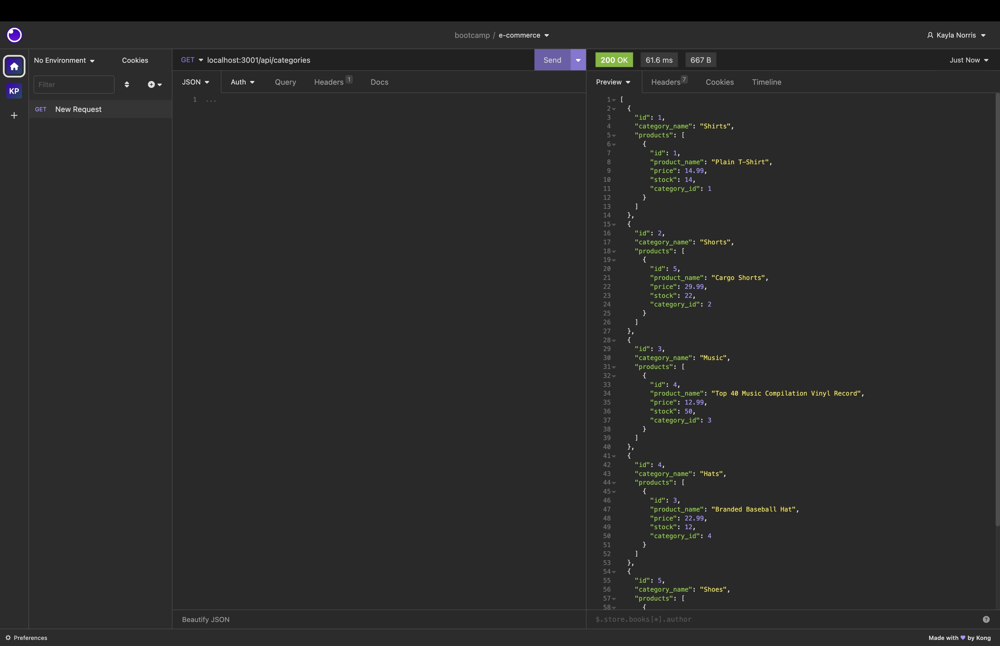

# E-commerce Back End Application

## Description
This application was made to be able to create a database for e-commerce. The application gives you the ability to get category, product, and tag information for products. As well as the ability to create, update, and delete data.

## Table of Contents
- [E-commerce Back End Application](#e-commerce-back-end-application)
  - [Description](#description)
  - [Table of Contents](#table-of-contents)
  - [Installation](#installation)
  - [Usage](#usage)
  - [Insomnia Example](#insomnia-example)
  - [Demonstration Video](#demonstration-video)
  - [License](#license)
  - [Questions](#questions)
## Installation

To use this application you will need to use Insomnia, Gitbash (or use the Mac terminal), MySql2, Sequelize, dotenv, and express.

To get started: 
- Clone the e-commerce back end repository by copying the link under the green code button on GitHub and running "git clone " in the terminal
- Create a .env file or put your credentials in the server.js file
- Then run the "npm init" command 
- Then run "npm i mysql2 sequelize dotenv express"
- Create your database using the MySQL shell in the terminal or MySQL Workbench via schema.sql
- Seed your database using the "npm run seed" command in the terminal
- Run "node server" to start the server

## Usage

Once you have the previous steps completed, open Insomnia. Use GET, POST, PUT and DELETE using the specified routes in the routes folder to make desired changes.

## Insomnia Example

## Demonstration Video
[Click here to view video!](https://www.youtube.com/watch?v=Y_HPaRmcfLo)

## License

  
Please refer to the LICENSE file in the repo.

## Questions

For more information, please contact me on [GitHub](https://github.com/KaylaNorris) 
or email me at kayla.e.norris@gmail.com
